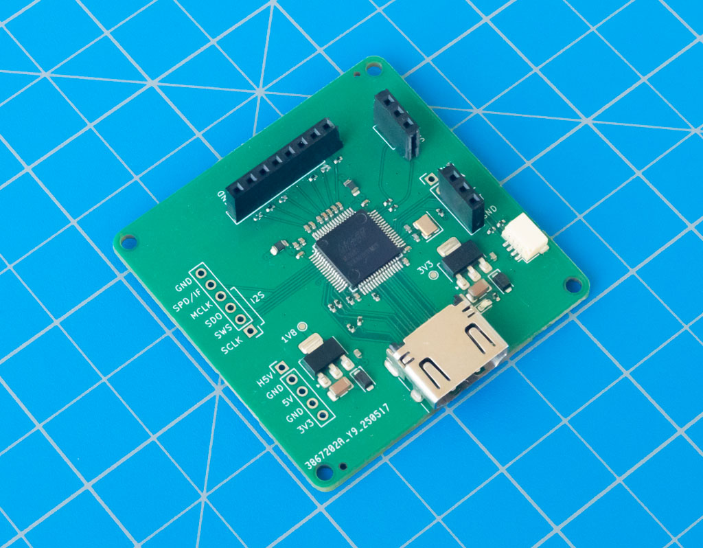
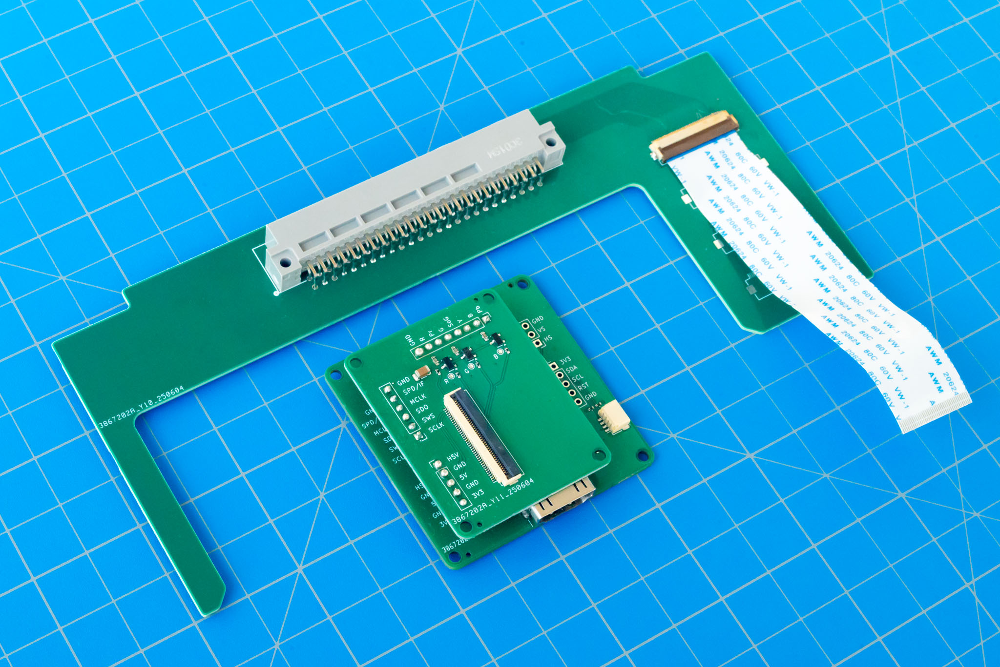
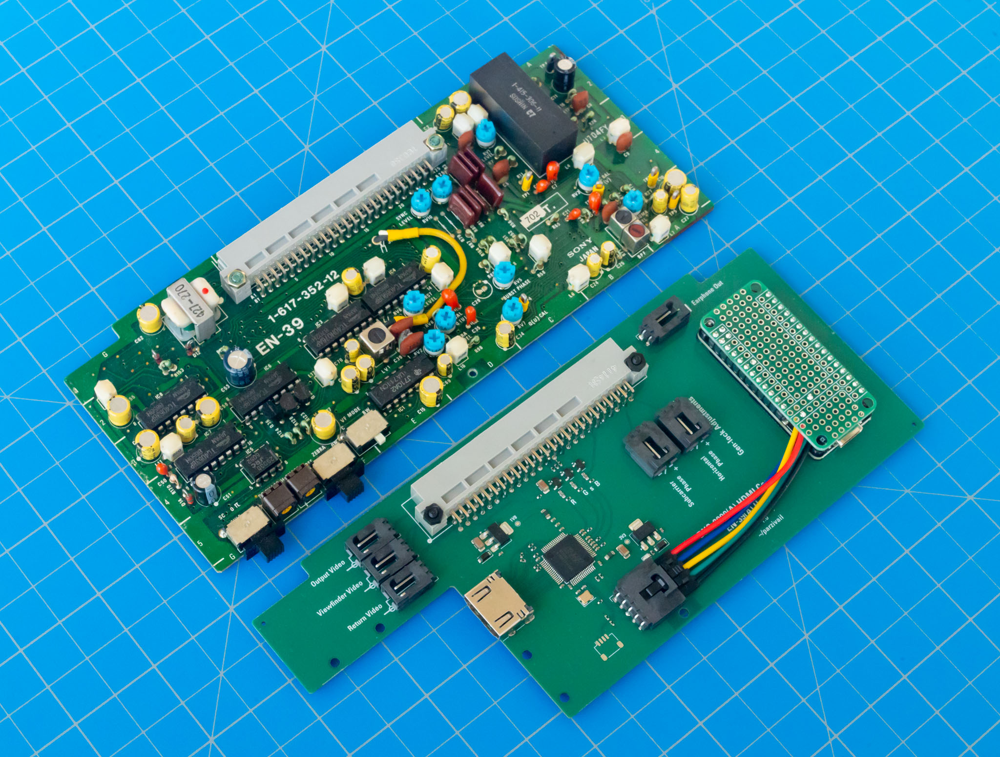

# Sony DXC-3000A HDMI Conversion

This repository is split into multiple KiCad projects.

## MS9282 breakout

Contains the MS9282 breakout

Directory: `ms9282_carrier`

## DXC-3000A module template

Contains the blank PCB that matches the physical dimensions and 50-pin header of the backplane modules

Directory: `module_template`

## DXC-3000A module breakout

A few assets in this image:

The DXC-3000A backplane-to-FPC breakout board
* Directory: `module_breakout`

The video conditioner "shield" for the MS9282 breakout
* Directory: `ms9282_carrier_adapter`

Pairs with the MS9282 breakout from above.

## MS9282 module

Contains the complete MS9282-based EN-39 substitute for HDMI conversion. The image shows it in comparison with the original EN-39 module.

Directory: `ms9282_module`